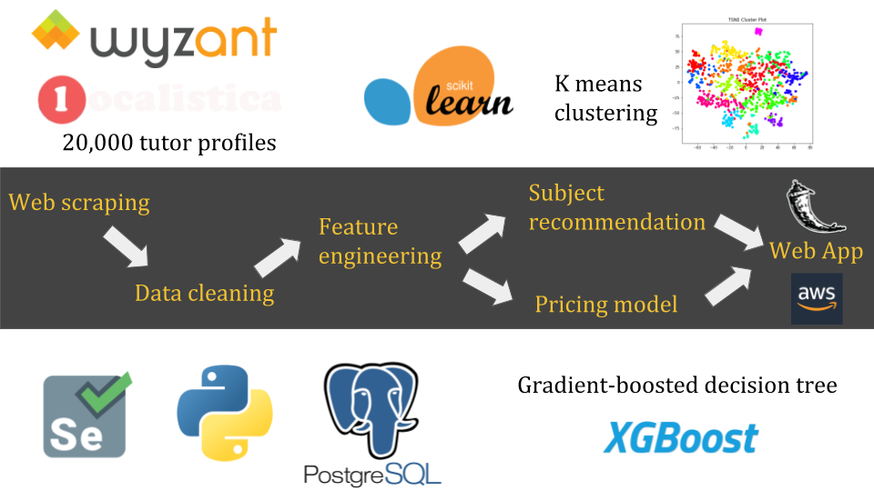
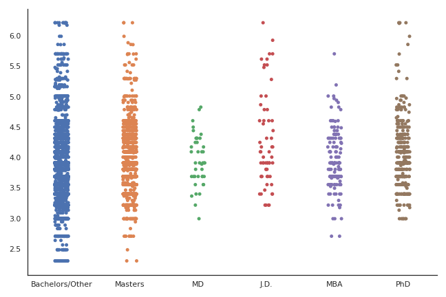
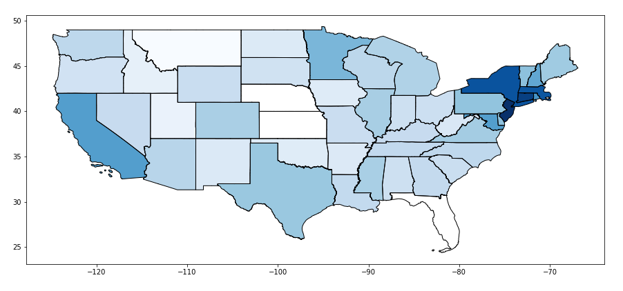
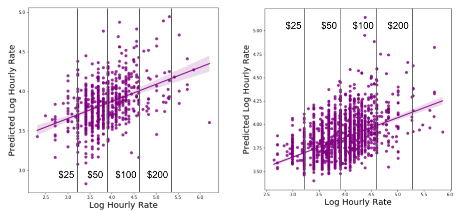
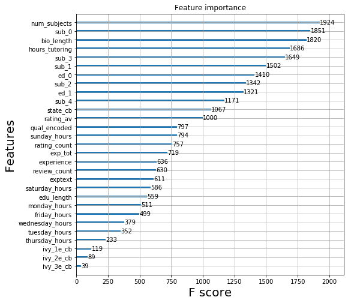
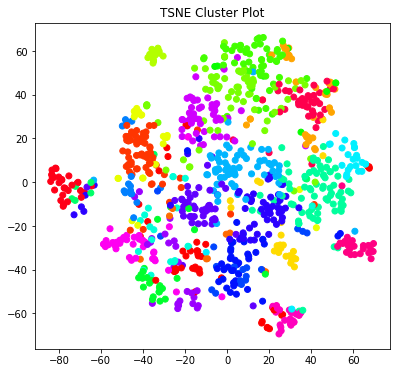

# AsTutor

Be astuter with your private tutition rate.

Enjoy the app at www.datamystic.xyz/input ! Answer the short questionnaire, enter your qualifications, and find how much you could earn as a private tutor.

## Contents

* `data_collect_and_clean` contains all scripts for data acquisition and cleaning (see readme inside folder for more details).
* `Models` contains scripts and notebooks for the regression and clustering models described in the text below (see readme inside folder for more details).
* `astutor_flask` contains all files and scripts for running the flask web app.

## Motivation

There are more than 1 million private tutors working in the USA as of 2020. Due to the explosion in tutoring websites (e.g. tutors.com, wyzant.com), the private tutoring market is projected to be worth almost $200 billion by 2026. 
With so much competition, aspiring tutors can find it challenging and intimidating to stand out from others.
One common source of uncertainty, that I have personally struggled with in the past, is choosing an hourly rate which is both suited to your qualifications and experience, while also not deterring potential customers from selecting you.
Doing a quick google search usually returns some blog posts, which contain detailed and overcomplicated rules for manually calculating your suggested rate. Often they include guesswork on your part anyway (such as adjustments for rare or high demand subjects), so they aren't very informative. 
I decided to create AsTutor, a data tool which helps prospective tutors to efficiently find a reliable estimate of their true market worth.

## Data Acquistion

The pipeline for development of the app is shown below.
I scraped the profiles of 20,000 private tutors from the popular website Wyzant, using Selenium and Beautiful soup. I attempted to get wide geographical and topical spread of profiles by using randomized zip codes and unrelated subjects as search terms in the scraping script.
Relevant information was extracted and cleaned before being stored in a postgreSQL database.
Additional features were then engineered by applying NLP methods to text elements in each tutor profile.
These features were then used as inputs to a regression model based on the xgboost gradient-boosted tree algorithm. 
Meanwhile, I also used k-means clustering of the tutor subject lists in order to characterize different types of tutor. This was used to provide tailored subject suggestions to users of the app.

## Features

A typical tutor profile contains the following easily extractable information:
* Average rating (5 star scale)
* Number of ratings
* Number of reviews
* Number of subjects taught
* Number of hours tutoring
* Hourly rate
* Schedule availability (number of hours per day)
* Background check (and date passed)

The distribution of hourly rates from the 20,000 profiles is shown below. It can be seen that the vast majority fall within the range $30 - $100, with a small fraction of elite tutors charging premium rates. In order to prepare the data for linear regression modelling, I took a log transformation, as shown in the right panel.

Using the hourly rate as a target variable, a simple pricing model could be built from the other numerical features. However, more interesting treds could be extracted from the text elements of the tutor profiles. Shown below is the variation in log hourly rate for different qualifications. There is a large difference between tutors holding a doctoral or law degree, compared to those who don't!

There was also a large geographical variation in average tutor rates, with darker colours on the map indicating higher rates.

Since there was clearly a lot of information to be gleaned from the bio, education, and subject list sections, I applied NLP methods to generate new features from these parts of the profile. I applied a TFIDF vectorizer to each section, which encoded the text as a numerical matrix. The matrix was reduced to 5 columns per section using PCA. Furthermore, other useful features, such as years of experience could be extracted by keyword matching. Subsequently, the new feature list included:
* TFIDF + PCA of tutor bio (5)
* TFIDF + PCA of education (5)
* TFIDF + PCA of subject list (5)
* Bio length in words
* Highest level of qualification
* Total years of experience tutoring
* If the tutor attended an ivy league school
* Mean tutor rate in their state (using catboost encoding to avoid data leakage https://catboost.ai/docs/)

## Regression model

After trialling several algorithms, I settled on xgboost as it provided the lowest mean absolute error, highest R2 value, and was relatively fast to run and optimize. Below is the performance of xgboost with the original feature list (left) and the updated feature list (right). With the new engineered features, the R2 increases from 0.17 to 0.22, while the mean absolute percentage error (MAPE) decreases from 10.3% to 6.7%. 

The informative nature of the engineered features is evident when extracting feature importances from the xgboost algorithm: it can be seen that they account for 8 of the top 10.

For comparison, the performance of some alternative popular machine learning models is shown in the table below.

| Model        | MAE ($/hour)           | R2  |
| ------------- |:-------------:| -----:|
| Linear Regression      | 13.7 | 0.15 |
| Lasso Regression      | 13.6      |   0.16 |
| Ridge Regression | 13.7      |   0.15 |
| Random Forest | 13.4      |   0.20 |
| XGBoost | 13.3      |   0.22 |

## Subject clustering

As seen in the feature importances chart, a tutor's list of subjects represents one of the most influencial factors in determining their predicted hourly rate. This is something that a tutor can easily take action on, so it would be useful for them to know if teaching certain subjects could merit charging a higher rate. However, it is important to only recommend subjects which fall within the expertise of that particular tutor, so a tailored recommendation is required for each user.
After TFIDF vectorization and PCA reduction, clusters of similar types of tutor could be visualized (see TSNE plot below). By extracting the most common subjects associated with each cluster, it becomes clear which tutors are more specialized in fields such as language, science and finance, for example. 

When users fill in their list of chosen subjects, the app assigns new users to a cluster using the k-means model. Any subject not listed by that user, but which is the top 10 list of recommended subjects for that cluster, is then suggested to the tutor on the result page.

## How does the app help?

Currently, an aspiring tutor has limited options for determining a reasonable value for their hourly rate. Blog posts and job websites (such as payscale.com) are very limited in their scope, and do not consider important factors such as geographical variation in subject demand. AsTutor will prevent tutors from consistently underrating their own qualifications (for example, I discovered that my own creditials merited a rate of $40 /hour as opposed to the $30 / hour I had charged in the past). 
The effectiveness of the subject recommender was assessed by calculating the difference in predicted hourly rate when using the tutor's original set of subjects, and when including their new recommended subjects, for a test dataset of 3000 held-out profiles. It was found that adding the new subjects to a tutor's profile increased their predicted hourly rate by $2.3 / hour on average. This suggests that the app gives consistently valuable advice. 
