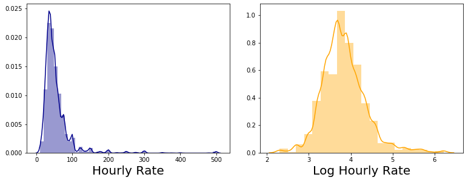

## AsTutor

Be astuter with your private tutition rate.

There are more than 1 million private tutors working in the USA as of 2020. Due to the explosion in tutoring websites (e.g. tutors.com, wyzant.com), the private tutoring market is projected to be worth almost $200 billion by 2026. 
With so much competition, aspiring tutors can find it challenging and intimidating to stand out from others.
One common source of uncertainty, that I have personally struggled with in the past, is choosing an hourly rate which is both suited to your qualifications and experience, while also not deterring potential customers from selecting you.
Doing a quick google search usually returns some blog posts, which contain detailed and overcomplicated rules for manually calculating your suggested rate. Often they include guesswork on your part anyway (such as adjustments for rare or high demand subjects), so they aren't very informative. 
I decided to create AsTutor, a data tool which allows prospectively tutors to efficiently find a reliable estimate of their true market worth.

## Data Acquistion

The pipeline for development of the app is shown below.
I scraped the profiles of 20,000 private tutors from the popular website Wyzant, using Selenium and Beautiful soup. I attempted to get wide geographical and topical spread of profiles by using randomized zip codes and unrelated subjects as search terms in the scraping script.
Relevant information was extracted and cleaned before being stored in a postgreSQL database.
Additional features were then engineered by applying NLP methods to text elements in each tutor profile.
These features were then used as inputs to a regression model based on the xgboost gradient-boosted tree algorithm. 
Meanwhile, I also used k-means clustering of the tutor subject lists in order to characterize different types of tutor. This was used to provide tailored subject suggestions to users of the app.

## Features

A typical tutor profile contains the following easily extractable information:
* Average rating (5 star scale)
* Number of ratings
* Number of reviews
* Number of subjects taught
* Number of hours tutoring
* Hourly rate
* Schedule availability (number of hours per day)
* Background check (and date passed)

The distribution of hourly rates from the 20,000 profiles is shown below. It can be seen that the vast majority fall within the range $30 - $100, with a small fraction of elite tutors charging premium rates. In order to prepare the data for linear regression modelling, I took a log transformation, as shown in the right panel.

Using the hourly rate as a target variable, a simple pricing model could be built from the other numerical features. However, more interesting treds could be extracted from the text elements of the tutor profiles. Shown below is the variation in log hourly rate for different qualifications. There is a large difference between tutors holding a doctoral or law degree, compared to those who don't!

There was also a large geographical variation in average tutor rates, with darker colours on the map indicating higher rates.

Since there was clearly a lot of information to be gleaned from the bio, education, and subject list sections, I applied NLP methods to generate new features from these parts of the profile. I applied a TFIDF vectorizer to each section, which encoded the text as a numerical matrix. The matrix was reduced to 5 columns per section using PCA.

## Model

After trialling several algorithms, I settled on xgboost as it provided the lowest mean absolute error, highest R2 value, and was relatively fast to run and optimize.

